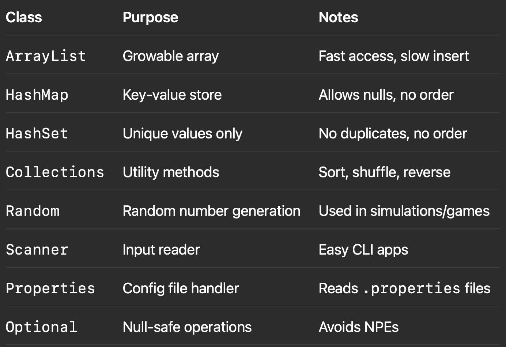

Here is the raw content for a .md file focused on the most common java.util objects used by Java application developers:

⸻


# ☕ Java Interview Prep — Common `java.util` Objects

## 📦 Overview

The `java.util` package provides essential classes and interfaces used in everyday Java development — such as collections, date/time, randomization, and utilities for formatting and properties management.

---

## 🧩 1. `ArrayList<E>`

**Purpose:** Resizable array that allows duplicates and maintains insertion order.

### ✅ Use Case
Useful when frequent reads and indexed access are needed.

### 🔹 Code Example:
```java
List<String> names = new ArrayList<>();
names.add("Alice");
names.add("Bob");
System.out.println(names.get(0)); // Alice
```

⸻

🧩 2. HashMap<K, V>

Purpose: Stores key-value pairs with constant-time lookup; does not maintain order.

✅ Use Case

Use when you need fast lookups and don’t care about order.

🔹 Code Example:

```java
Map<String, Integer> scores = new HashMap<>();
scores.put("Math", 95);
System.out.println(scores.get("Math")); // 95
```

⸻

🧩 3. HashSet<E>

Purpose: Stores unique elements; no duplicates allowed.

✅ Use Case

Ideal when you need to ensure uniqueness in a collection.

🔹 Code Example:
```java
Set<String> tags = new HashSet<>();
tags.add("java");
tags.add("java");
System.out.println(tags.size()); // 1
```

⸻

🧩 4. Collections (Utility Class)

Purpose: Provides static methods for working with collections (e.g., sorting, shuffling).

🔹 Code Example:
```java
List<Integer> list = Arrays.asList(3, 1, 2);
Collections.sort(list);
System.out.println(list); // [1, 2, 3]
```

⸻

🧩 5. Date and Calendar (Legacy)

Purpose: Legacy date/time API. Replaced by java.time in Java 8, but still encountered.

⸻

🧩 6. Random

Purpose: Generate pseudo-random numbers.

🔹 Code Example:
```java
Random rand = new Random();
int number = rand.nextInt(100); // Random number between 0–99
```

⸻

🧩 7. Scanner

Purpose: Reads input from various sources (keyboard, file, etc.)

🔹 Code Example:
```java
Scanner scanner = new Scanner(System.in);
String name = scanner.nextLine();
System.out.println("Hello, " + name);
```

⸻

🧩 8. Properties

Purpose: Read/write .properties configuration files.

🔹 Code Example:
```java
Properties props = new Properties();
props.load(new FileReader("app.properties"));
System.out.println(props.getProperty("db.url"));
```

⸻

🧩 9. Optional<T> (Java 8+)

Purpose: Avoid null checks and NullPointerException.

🔹 Code Example:
```java
Optional<String> value = Optional.of("Hello");
value.ifPresent(System.out::println); // Hello
```

⸻

❓ Common Interview Questions

1. Difference between ArrayList and LinkedList?
	•	ArrayList is faster for indexed access.
	•	LinkedList is better for frequent inserts/removals at ends.

⸻

2. Why use HashSet over ArrayList?
	•	HashSet avoids duplicates and provides faster lookups.

⸻

3. What is the default load factor of HashMap?
	•	0.75 — balances time and space efficiency.

⸻

4. How to make a Map thread-safe?
	•	Use Collections.synchronizedMap() or ConcurrentHashMap.

⸻

5. What’s the difference between Optional.of() and Optional.ofNullable()?
	•	of() throws NullPointerException if value is null.
	•	ofNullable() safely handles null.

⸻

✅ Summary Table




⸻

This guide gives you an edge in interviews by mastering the most practical and frequently used utilities in java.util.

Let me know if you want this exported as a `.md` file or want the next section on `java.time`, `java.util.concurrent`, or collections performance.